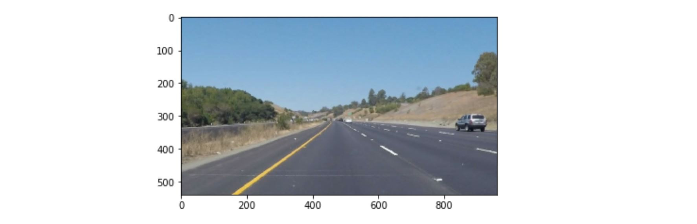
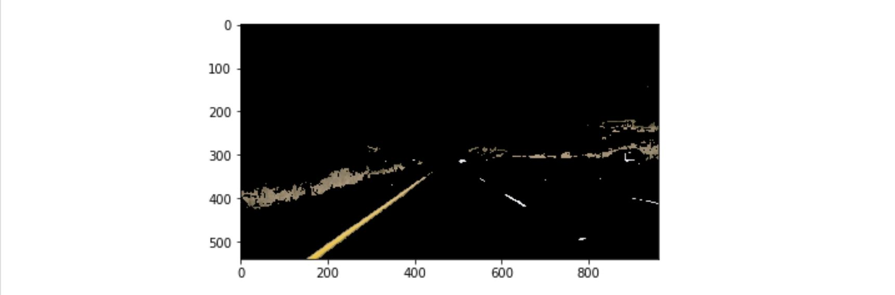
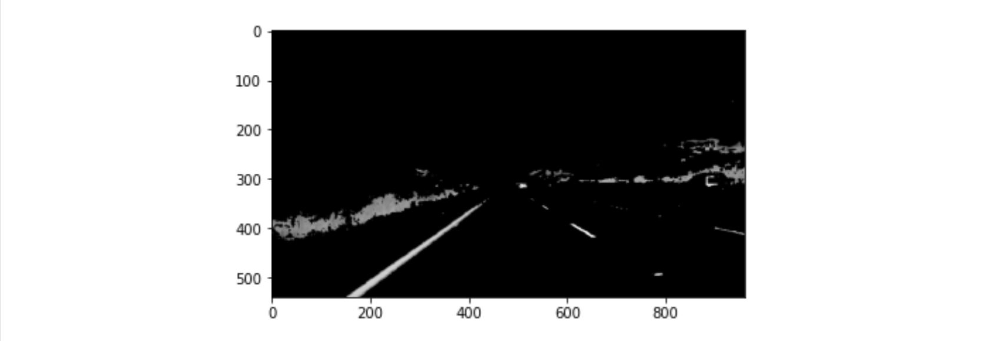
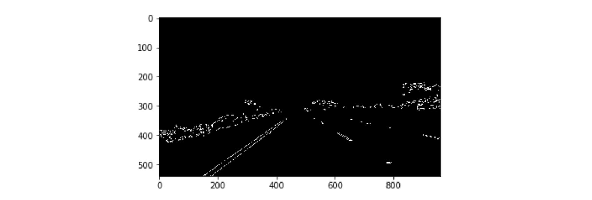
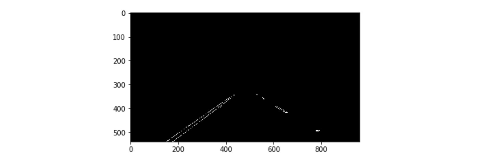
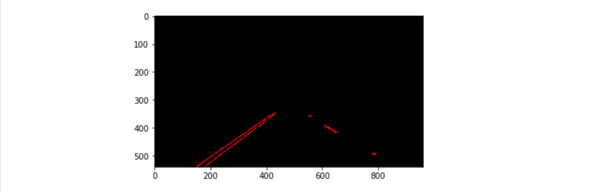
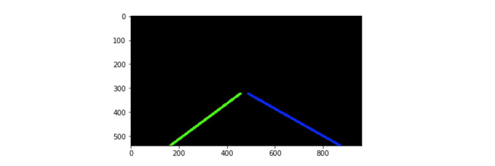
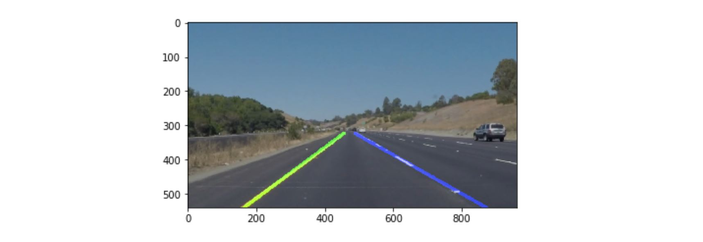

# Lane Lines Detection 

Computer Vision algorithm to detect straight lane lines markings on road using OpenCV Image Processing, Color Masks, Canny Edge Detection and Hough Transform. 


One of the most fundamental tasks in computer vision for autonomous driving is lane lines detection on road. Lane lines are painted for humans to see and follow while driving. In a very similar way, an autonomous vehicle that uses human designed infrastructure, needs to *see* the lane markings to steer accordingly and follow the road trajectory.

In this project I implemented a computer vision algorithm that processes real data recorded with the front facing camera of a vehicle driving on a California highway.
The result is a processed video that highlights the lane lines on the paved road. 

With the positions of the lane lines identified, the vehicle's offset from the lane's center can be calculated and feed a PD controller to compute the necessary steering angle. While only the lane lines detection is the scope of this project, my steering algorithm is implemented [here](https://github.com/OanaGaskey/PID-Controller)  
 
This project is implemented in Python and uses OpenCV image processing library. The source code can be found in the `finding_lane_lines.ipynb` Jupyter Notebook file above. 
The starter code for this project is provided by Udacity and can be found [here](https://github.com/udacity/CarND-LaneLines-P1).


## Define Color Masks

Looking at the video recording from the car, one of the most defining characteristics of lane lines is that they are white or yellow against a darker road color.




Defining color masks allows color based pixels selection in an image. The intention is to select only white and yellow pixels and set the rest of the image to black.


```
    ### create a color mask ###
    #convert from RGB to HSV
    hsv_img = cv2.cvtColor(img, cv2.COLOR_RGB2HSV)

    #define two color masks for yellow and white
    #white mask is applied in RGB color space, it's easier to tune the values
    #values from 200 to 255 on all colors are picked from trial and error
    mask_white = cv2.inRange(img, (200,200,200), (255, 255, 255))

    #yellow mask is done in HSV color space since it's easier to identify the hue of a certain color
    #values from 15 to 25 for hue and above 60 for saturation are picked from trial and error
    mask_yellow = cv2.inRange(hsv_img, (15,60,20), (25, 255, 255))

    #combine the two masks, both yellow and white pixels are of interest
    color_mask = cv2.bitwise_or(mask_white, mask_yellow)

    #make a copy of the original image
    masked_img = np.copy(img)
    
    #pixels that are not part of the mask(neither white or yellow) are made black
    masked_img[color_mask == 0] = [0,0,0]
    
```

Image processing techniques can be applied to RGB colorspace but for color selection, the HSV space is much better. Hue, Saturation and Value are easier to work with mainly because the *hue* value carries the color of each pixel.

The yellow mask is built from the HSV image to select pixels with hue between `15` and `25` and saturation above `60`. These values were identified from the images to be corresponding to the yellow lane markings.
The white mask is built from the RGB image where all three color channels of a pixel have to be above 
the threshold value of `200`. This accurately selects the white markings on the pavement.

The two masks are applied using `bitwise_or` so both white and yellow pixels are kept. All other pixels are set to black. With this selection all lane lines pixels are correctly selected. There is also some noise left in the picture, mainly from dried grass that corresponds to the yellow collor and white cars on the highway. This will be removed with further processing.




## Smoothen Image

Once the image is masked and only white and yellow pixels are kept, color is no longer important so the image is turned into grayscale for easier processing.  

```
    ### smoothen image ###
    #turn the masked image to grayscale for easier processing
    gray_img = grayscale(masked_img)

    #to get rid of imperfections, apply the gaussian blur
    #kernel chosen 5, no other values are changed the implicit ones work just fine
    kernel_size = 5
    blurred_gray_img = cv2.GaussianBlur(gray_img, (kernel_size, kernel_size), 0)    
```




To prepare for edge detection it is usefull to smoothen the image so artificial edges are not detected due to noise. For this the Gaussian blurr is applied with kernel 5 and further default values.


## Detect Edges

For lane line detection purposes edge detection is used. It is much better to work with edges than the whole body of the lane line. The main reason for this is the further need to compute line equations from independent pixels. 

```
    ### detect edges ###
    #choose values for te Canny Edge Detection Filter
    #for the differentioal value threshold chosen is 150 which is pretty high given that the max 
    #difference between black and white is 255
    #low threshold of 50 which takes adjacent differential of 50 pixels as part of the edge
    low_threshold = 50
    high_threshold = 150
    edges_from_img = cv2.Canny(blurred_gray_img, low_threshold, high_threshold)
```




Edges are detected using the [Canny Edge Filter](http://fourier.eng.hmc.edu/e161/lectures/canny/node1.html) appliend to a grayscale image. The Canny Edge Filter is essentially computing the gradient across the image with respect to `x` and `y` directions, the resulting matrix representing the difference in intensity between adjecent pixels.

The algorithm will first detect strong edge (strong gradient) pixels above the `high_threshold`, `150` for our images, and reject pixels below the `low_threshold`, here chosen to be `50`. Next, pixels with values between the `low_threshold` and `high_threshold` will be included as long as they are connected to strong edges. The output edges is a binary image with white pixels tracing out the detected edges and black everywhere else.


## Select Region of Interest

In the edge processing resulting image, the lane line edges are correctly identified, but there are a lot of other unnecessary edges as well. These are mainly from objects located outside the road, or maybe edges defining boundaries of other cars. To eliminate this noise, I took advantage of the constant region of interest in the image.

```
    ### select region of interest###
    #define a polygon that should frame the road given that the camera is in a fixed position
    #polygon covers the bottom left and bottom right points of the picture
    #with the other two top points it forms a trapezoid that points towards the center of the image
    #the polygon is relative to the image's size
    imshape = img.shape
    vertices = np.array([[(0,imshape[0]),(4*imshape[1]/9, 6*imshape[0]/10), (5*imshape[1]/9, 6*imshape[0]/10), (imshape[1],imshape[0])]], dtype=np.int32)
    masked_edges = region_of_interest(edges_from_img, vertices)
```

A polygon is defined based on the hypothesis that the camera is mounted on a fixed position on the car. A trapezoid is selected that starts at the bottom of the image and goes towards the center. The values are identified visually from the pictures.

The `region_of_interest` function creates a mask using `cv2.fillPoly(mask, vertices, 255)`. `mask` is initially a zeroes matrix of the same size as the grayscale image. The `fillPoly` creates a polygon based on the given vertices and sets all the pixels within to `255`. The mask is applied using `bitwise_and` to the grayscale image.




## Find Lines from Edge Pixels

The whole reason the edge detection was performed was to obtain pixels from which line equations can be calculated. [Hough Transform](https://en.wikipedia.org/wiki/Hough_transform) is futher used to form lines from colinear pixels.

The Hough Transform takes pixels from the `(x, y)` coordinates of image space and transforms them to hough space. A the straight line in image space `y = mx + b` can be represented as a point `(b, m)` in the hough space. Similarly, in hough space each image space point is transformed into a line, this line represents all the image space lines that can go through the selected point. 

When multiple lines intersect in one point (or larger defined area) in the hough space, this indicates that the corresponding points in the image space are coliniar.

The hough space as `(b, m)` rises some problems for vertical lines in the image space, for which `m` is infinite. For this reason, the hough space was chosen to be represented as `(rho, theta)`.

`rho` is the distance from the origin to the closest point on the straight line, and `theta` is the angle between the `x` axis and the line connecting the origin with that closest point.

It is therefore possible to associate with each line of the image a pair of `(rho, theta)`. With this approach, a straight line in image space is `rho = x * cos(theta) + y * sin(theta)`

```
    ### find lines from edges pixels ###
    #define parameters for the Hough transform
    #Hough grid resolution in pixels
    rho = 2

    #Hough grid angular resolution in radians 
    theta = np.pi/180 

    #minimum number of sines intersecting in a cell, collinear points to form a line
    threshold = 15

    #minimum length of a line in pixels
    min_line_len = 10 

    #maximum gap in pixels between segments to be considered part of the same line 
    max_line_gap = 5   

    #apply Hough transform to color masked grayscale blurred image
    line_img = cv2.HoughLinesP(masked_edges, rho, theta, threshold, np.array([]), minLineLength=min_line_len, maxLineGap=max_line_gap)
```

When using the Hough Transform to find lines from coliniar pixels, `rho` and `theta` are defined to allow for some flexibility. `rho` as the grid resolution in pixels, is set to `2`. 
`theta` as the grid angular resolution in radians and I chose it to be the equivalent of `1` degree.

The minimum length is `10` pixels to consider that they form a line. The maximum gap between two segments of the same line is `5` pixels. 

These lines are computed with the `HoughLinesP` function that applies the transform on the edges in the region of interest. Once the lines found, they are drawn over the original image for confirmation.




## Extrapolate Lines

In order to draw a single line on the left and one on the right lane lines, the `draw_lines` function is built to extrapolate from the multiple individiual lines found using the Hough Transform. 

Lines from Hough tranform are grouped in left and right category based on the computed slope. Once grouped, the average slope is calculated together with the standard deviation. 
In order to eliminate lines that are not aligned with the rest, only lines that have a consistent slope are kept. 

Using the slope and intercept of the line, the extrapolation is performed to match the hight of the region of interest. This is done by calculatig the intersection points of the line with the horizontal middle edge: `y = 6.imshape[0]/10` and with the horizontal bottom line of  the image: `y = imshape[0]`




Using the two intersection points, the extrapolated line is drawn on the original image. The line is semi transparent so a visual check can be made to verify if the line correspnds with the lane markings. For better visualization, the left line is green while the right one is blue.
 



## Video Output

Check out the restulting video! You can download the video here: [./test_videos_output/solidWhiteRight.mp4](./test_videos_output/solidWhiteRight.mp4)

