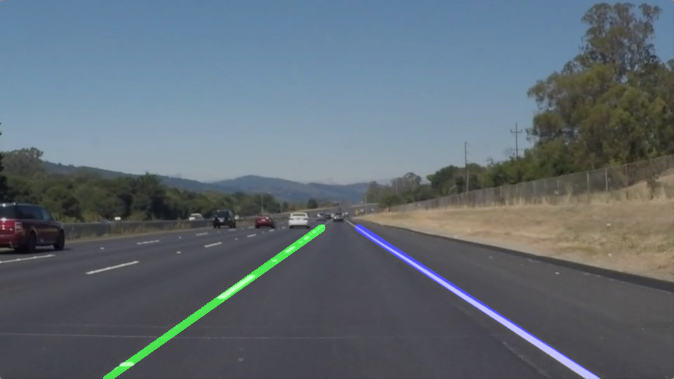

# **Finding Lane Lines on the Road** 

## Writeup Oana Gaskey

---

**Finding Lane Lines on the Road**

The goals / steps of this project are the following:
* Make a pipeline that finds lane lines on the road
* Reflect on your work in a written report

---

### Reflection

### 1. Describe your pipeline. As part of the description, explain how you modified the draw_lines() function.

My pipeline consists of 5 steps. 

1. Color Mask
In order to better distinguish the lane lines from other lines in the images, like curb or grass edges, I created a color mask.
This mask consists of two components. The white mask is applied on the RGB image where all three color channels of a pixel have to be above 
the threshold value of 200. This accurately selects the white markings on the pavement. The yellow mask is applied on the HSV converted image as the hue interval is easier to identify. The mask selects pixels with hue between 15 and 25 and saturation above 60. These values are found through trial and error from one of the provided pictures.

2. Smoothen Image
Once the image is masked and only white and yellow pixels are kept, color is no longer important so it is turned into grayscale for easier processing. To prepare for edge detection it is usefull to smoothen the image so artificial edges are not detected due to noise. For this the Gaussian blurr is applied with kernel 5 and further default values.

3. Detect Edges
Edges are detected using the Canny edge filter. For the differential value threshold 150 is used to only identify high intensity change. The low threshold is set to 50 to also detect pixels of lower change in intensity but who are along the high ones.

4. Select Region of Interest
A polygon is defined based on the hypothesis that the camera is mounted on a fixed position on the car. A trapezoid is selected that starts at the bottom of the image and goes towards the center. The values are identified visually from the pictures.

5. Find Lines from Edge Pixels
Hough transform is used to form lines from colinear pixels. The Hough grid resolution is set to 2 pixels and the angular resolution to one radian. The minimum line length is 10 pixels and the maximum gap between two segments of the same line is 5 pixels. These values were found in the previous lessons. These lines are found with the "hough_lines" function that applies the transform on the edges in the region of interest.
Once the lines found, they are drawn over the original image for confirmation.

In order to draw a single line on the left and right lanes the draw_lines function is built as follows. Lines from Hough tranform are grouped in left and right category based on the computed slope. Negative slope means it's part of the left line, positive slope means it's part of the right line. Once grouped, a symetric approach is used for each side. I calculated the average slope of all the lines from one side and their standard deviation. In order to eliminate lines that are not aligned with the rest, only lines that have a consistent slope are kept. From the kept lines I calculated the average slope and intercept.
In case there are no lines detected in the picture, or if the lines are not aligned well enough, default values are used. The default values for slope and intercept are taken from running the algorithm on "solidWhiteRight.jpg" picture.
Using the slope and intercept of the line, the extrapolation is performed to match the hight of the region of interest. This is done by calculatig the intersection points of the line with the horizontal middle edge: y = 6*imshape[0]/10 and with the horizontal bottom line of  the image: y = imshape[0]
Using the two intersection points, the extrapolated line is drawn on the original image. The line is semi transparent so a visual check can be made to verify if the line correspnds with the lane markings. Symmetrically the same logic is applied on the right side.
For better visualization, the left line is green while the right one is blue.

 

### 2. Identify potential shortcomings with your current pipeline

The shortcoming of my algorithm is that the lines are jumpy. This happends especially on interrupted lines and around curves.
Another potential problem could occur if the lanes are not as well marked as on the Californian highway and the color mask might need tunning.

### 3. Suggest possible improvements to your pipeline

An improvement could be to filter the slope and intercept values over time. I would do that by keeping a history of the last 10 cycles (images) and implement a low pass filter. In the low pass filter the last measurement (current image) would have the most weight but the past 9 would also be taken into consideration. In this way, the change in slope and intercept will not be so abrupt from one cycle to the next. 
